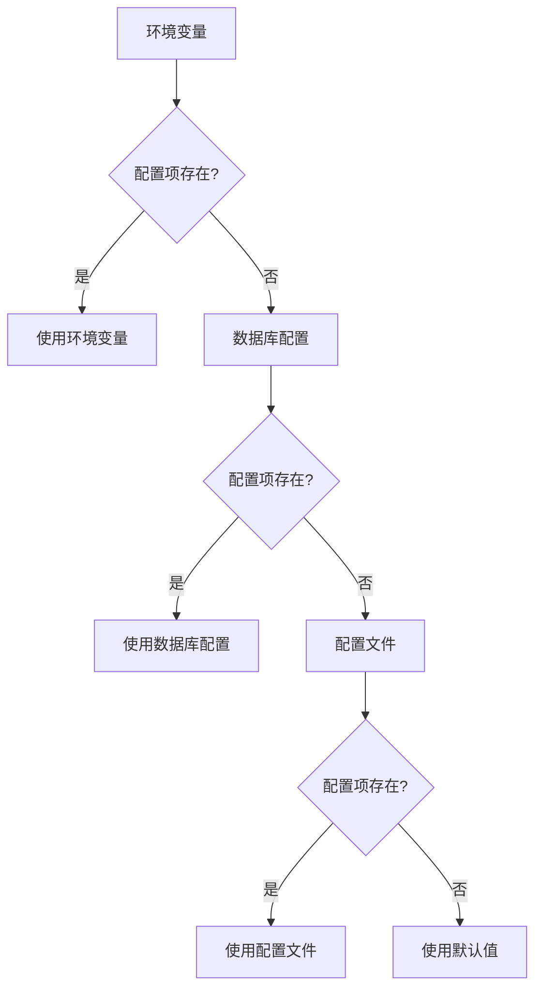
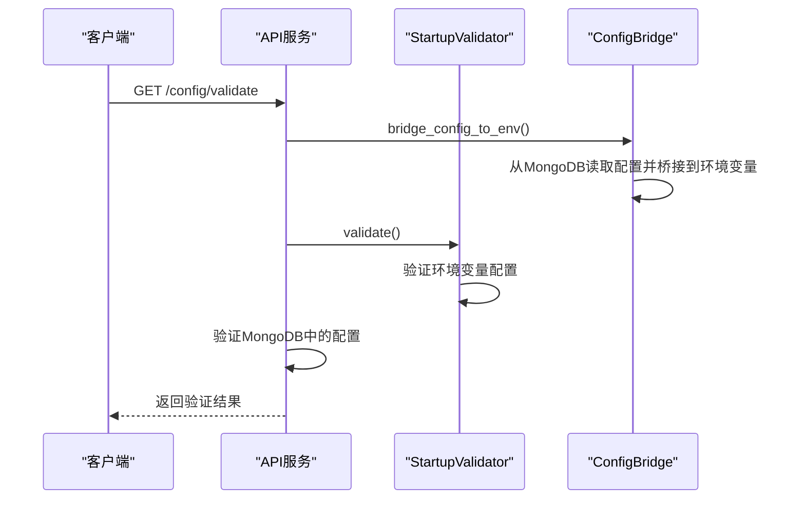

# 配置管理

<cite>
**本文档引用的文件**  
- [unified_config.py](file://app/core/unified_config.py)
- [config.py](file://app/core/config.py)
- [config_bridge.py](file://app/core/config_bridge.py)
- [config_compat.py](file://app/core/config_compat.py)
- [config_service.py](file://app/services/config_service.py)
- [system_config.py](file://app/routers/system_config.py)
- [config.py](file://app/models/config.py)
- [README.md](file://config/README.md)
- [UNIFIED_CONFIG.md](file://docs/configuration/UNIFIED_CONFIG.md)
- [migrate_config_to_db.py](file://scripts/migrate_config_to_db.py)
- [config_management_demo.py](file://examples/config_management_demo.py)
</cite>

## 目录
1. [引言](#引言)
2. [统一配置系统](#统一配置系统)
3. [配置项详解](#配置项详解)
4. [配置优先级机制](#配置优先级机制)
5. [配置迁移指南](#配置迁移指南)
6. [配置验证机制](#配置验证机制)
7. [配置文件示例](#配置文件示例)
8. [最佳实践建议](#最佳实践建议)
9. [结论](#结论)

## 引言
sagacity平台的配置管理体系旨在提供一个统一、灵活且安全的配置管理解决方案。该体系整合了传统的JSON配置文件、环境变量和数据库配置，通过统一的接口进行管理。本文档将详细介绍统一配置系统的设计理念、实现方式、配置项含义、优先级机制、迁移路径、验证机制以及最佳实践。

## 统一配置系统

sagacity平台的统一配置系统（Unified Config）是一个核心组件，负责整合和管理平台的各类配置。该系统通过`UnifiedConfigManager`类实现，提供了标准化的配置数据模型和统一的配置读写API。

### 设计理念
统一配置系统的设计理念是“兼容性、统一性、实时性、性能优化”。系统在保持与现有配置文件格式兼容的同时，提供了一个统一的配置接口，确保多模块间配置数据的一致性，并通过智能缓存机制提高配置读取性能。

### 架构设计
统一配置系统的架构设计包括以下几个核心组件：
- **UnifiedConfigManager**: 统一配置管理器，负责配置的读取、写入和同步。
- **ConfigPaths**: 配置文件路径管理，定义了各类配置文件的路径。
- **配置适配器**: 在不同格式间转换，确保配置数据的兼容性。
- **缓存机制**: 提高配置读取性能，通过文件修改时间检测实现按需加载。

### 功能特性
统一配置系统具备以下功能特性：
- **向后兼容**: 保持现有`config/*.json`文件格式不变，支持现有TradingAgents配置系统。
- **统一接口**: 提供标准化的配置数据模型和统一的配置读写API。
- **实时同步**: WebAPI修改配置时自动同步到传统格式，确保多模块间配置数据一致性。
- **性能优化**: 智能缓存机制，文件修改时间检测，按需加载配置数据。

**Section sources**
- [unified_config.py](file://app/core/unified_config.py#L1-L501)

## 配置项详解

### LLM配置
LLM配置用于管理大模型的供应商、模型名称、API密钥等信息。配置项包括：
- **provider**: 供应商标识（如openai、dashscope）。
- **model_name**: 模型名称。
- **api_key**: API密钥（可选，优先从厂家配置获取）。
- **api_base**: API基础URL。
- **max_tokens**: 最大token数。
- **temperature**: 温度参数。
- **enabled**: 是否启用。

### 数据源配置
数据源配置用于管理各类数据源的连接信息。配置项包括：
- **name**: 数据源名称。
- **type**: 数据源类型（如akshare、tushare）。
- **api_key**: API密钥。
- **endpoint**: API端点。
- **timeout**: 请求超时时间（秒）。
- **rate_limit**: 每分钟请求限制。
- **enabled**: 是否启用。
- **priority**: 优先级，数字越大优先级越高。

### 缓存配置
缓存配置用于管理系统的缓存策略。配置项包括：
- **CACHE_TTL**: 缓存TTL（秒）。
- **SCREENING_CACHE_TTL**: 筛选缓存TTL（秒）。
- **CACHE_ENABLED**: 是否启用缓存。

### 系统设置
系统设置用于管理平台的全局配置。配置项包括：
- **DEBUG**: 是否启用调试模式。
- **HOST**: 服务监听地址。
- **PORT**: 服务监听端口。
- **ALLOWED_ORIGINS**: 允许的跨域来源。
- **MONGODB_HOST**: MongoDB主机地址。
- **REDIS_HOST**: Redis主机地址。
- **JWT_SECRET**: JWT密钥。
- **LOG_LEVEL**: 日志级别。

**Section sources**
- [config.py](file://app/core/config.py#L1-L301)
- [config.py](file://app/models/config.py#L1-L482)

## 配置优先级机制

sagacity平台的配置优先级机制遵循“环境变量 > 数据库配置 > 配置文件”的原则。具体如下：
1. **环境变量**: 优先级最高，用于覆盖数据库和配置文件中的配置。
2. **数据库配置**: 优先级次之，用于存储用户通过Web界面修改的配置。
3. **配置文件**: 优先级最低，用于存储默认配置和静态配置。

### 优先级示例


**Diagram sources**
- [config.py](file://app/core/config.py#L1-L301)
- [config_bridge.py](file://app/core/config_bridge.py#L1-L738)

## 配置迁移指南

### 自动迁移
系统启动时会自动读取现有配置文件，无需手动迁移。统一配置系统会自动将传统配置文件迁移到数据库中，并保持与现有配置文件格式的兼容性。

### 手动迁移工具
```bash
# 运行配置迁移工具
python scripts/migrate_config_to_db.py

# 测试配置兼容性
python scripts/test_config_compatibility.py
```

### 迁移步骤
1. **备份现有配置**: 自动备份到`config_backup/`目录。
2. **读取传统配置**: 解析现有JSON文件。
3. **转换格式**: 转换为统一配置格式。
4. **验证配置**: 测试配置的正确性。
5. **同步保存**: 保存到数据库和传统格式。

**Section sources**
- [migrate_config_to_db.py](file://scripts/migrate_config_to_db.py#L1-L396)
- [UNIFIED_CONFIG.md](file://docs/configuration/UNIFIED_CONFIG.md#L1-L294)

## 配置验证机制

### 验证接口
系统提供了`/config/validate`接口，用于验证系统配置的完整性和有效性。该接口会检查环境变量配置和MongoDB中的配置，返回验证结果。

### 验证内容
- **环境变量配置**: 检查必需的环境变量是否配置。
- **MongoDB配置**: 检查大模型厂家和数据源配置的有效性。
- **配置完整性**: 检查配置项是否完整，是否存在无效配置。

### 验证示例


**Diagram sources**
- [system_config.py](file://app/routers/system_config.py#L1-L285)
- [config_bridge.py](file://app/core/config_bridge.py#L1-L738)

## 配置文件示例

### 完整配置示例
```json
{
  "config_name": "统一系统配置",
  "llm_configs": [
    {
      "provider": "openai",
      "model_name": "gpt-3.5-turbo",
      "api_key": "sk-xxx",
      "api_base": "https://api.openai.com/v1",
      "max_tokens": 4000,
      "temperature": 0.7,
      "enabled": true
    }
  ],
  "default_llm": "gpt-3.5-turbo",
  "data_source_configs": [
    {
      "name": "AKShare",
      "type": "akshare",
      "endpoint": "https://akshare.akfamily.xyz",
      "enabled": true,
      "priority": 1
    }
  ],
  "system_settings": {
    "max_concurrent_tasks": 3,
    "default_analysis_timeout": 300,
    "enable_cache": true
  }
}
```

**Section sources**
- [UNIFIED_CONFIG.md](file://docs/configuration/UNIFIED_CONFIG.md#L220-L251)

## 最佳实践建议

### 配置管理
- **定期备份**: 定期备份`config/`目录中的配置文件，防止配置丢失。
- **敏感信息保护**: 敏感信息（如API密钥）应妥善保护，避免提交到公共代码仓库。
- **配置版本管理**: 使用Git等版本控制系统管理配置文件，便于追踪配置变更。

### 性能优化
- **合理设置缓存TTL**: 根据业务需求合理设置缓存TTL，避免缓存过期过快或过慢。
- **优化数据库连接**: 合理设置数据库连接池大小，避免连接过多或过少。
- **监控配置变更**: 监控配置变更，及时发现和解决配置问题。

### 安全性
- **最小权限原则**: 配置文件和目录应设置适当的读写权限，遵循最小权限原则。
- **定期审计**: 定期审计配置文件，确保配置项的正确性和安全性。
- **使用环境变量**: 敏感信息应通过环境变量配置，避免硬编码在配置文件中。

**Section sources**
- [README.md](file://config/README.md#L1-L29)
- [UNIFIED_CONFIG.md](file://docs/configuration/UNIFIED_CONFIG.md#L254-L266)

## 结论
sagacity平台的统一配置系统提供了一个强大、灵活且安全的配置管理解决方案。通过统一的接口和智能的优先级机制，系统确保了配置数据的一致性和可靠性。本文档详细介绍了配置体系的设计理念、实现方式、配置项含义、优先级机制、迁移路径、验证机制以及最佳实践，帮助用户更好地理解和使用sagacity平台的配置管理功能。