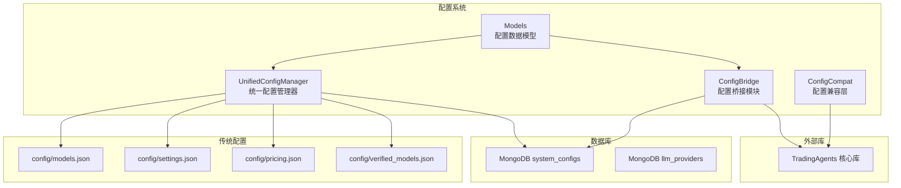
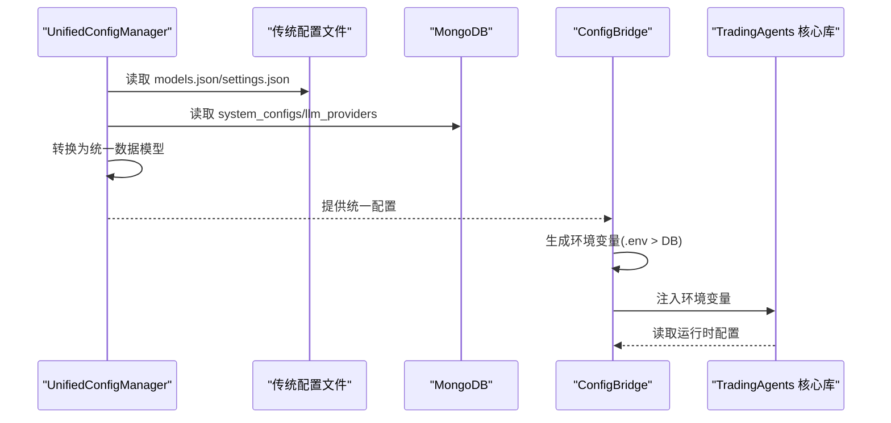
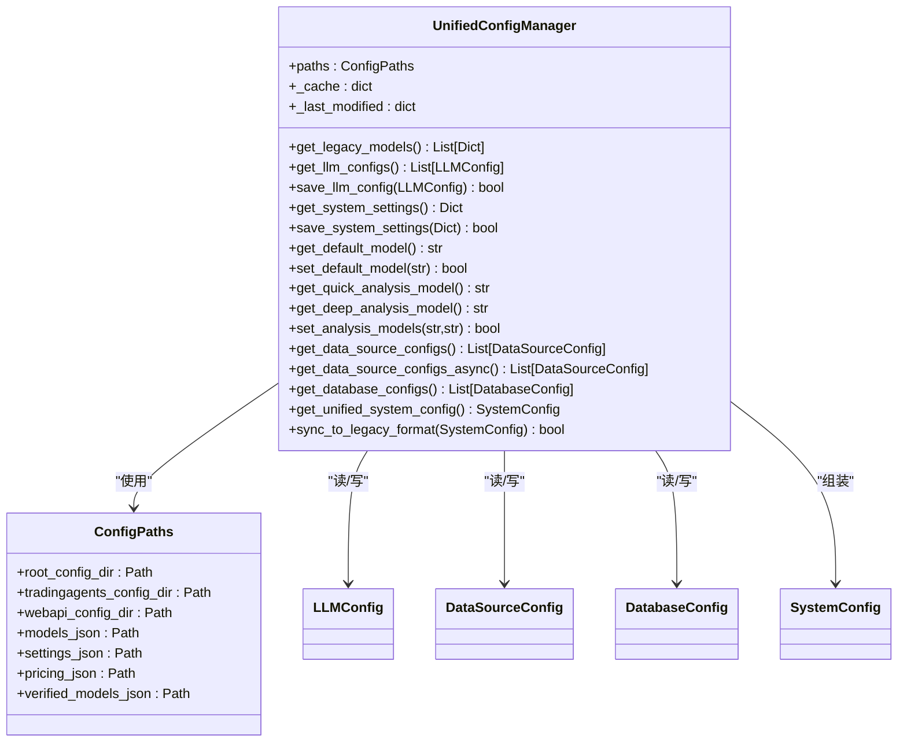
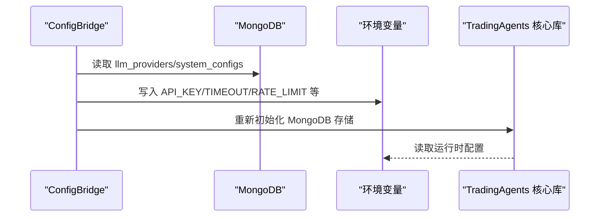
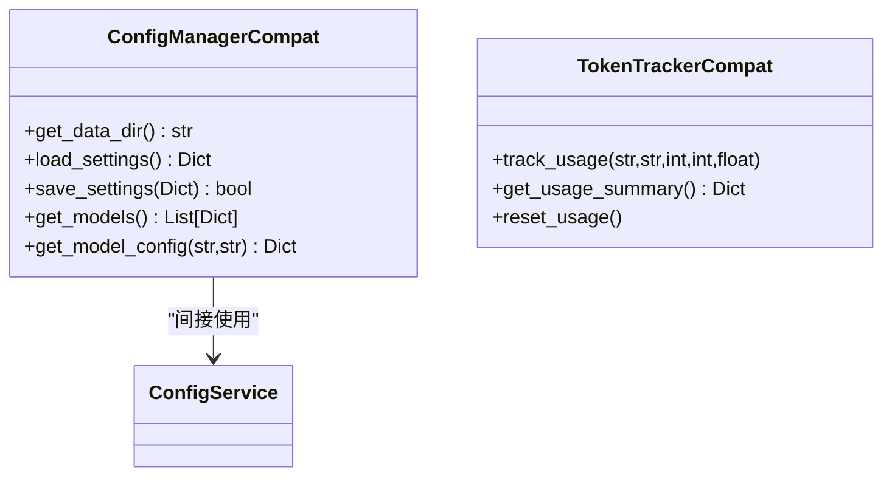
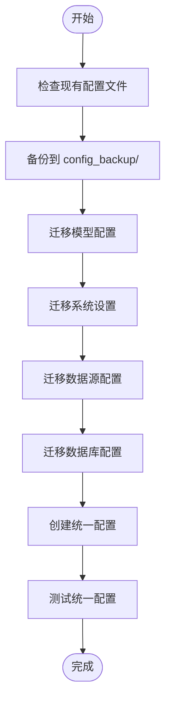
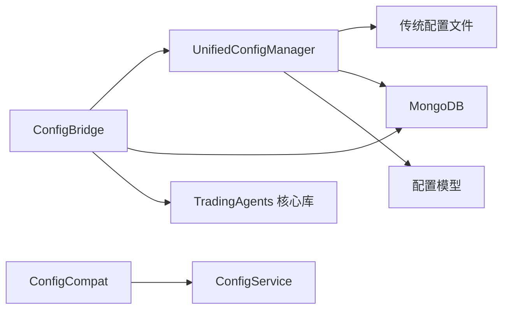

# 配置迁移

<cite>
**本文引用的文件**
- [app/core/config.py](file://app/core/config.py)
- [app/core/unified_config.py](file://app/core/unified_config.py)
- [app/core/config_bridge.py](file://app/core/config_bridge.py)
- [app/core/config_compat.py](file://app/core/config_compat.py)
- [app/models/config.py](file://app/models/config.py)
- [scripts/migrate_config.py](file://scripts/migrate_config.py)
- [scripts/test_config_compatibility.py](file://scripts/test_config_compatibility.py)
- [scripts/test_config_bridge.py](file://scripts/test_config_bridge.py)
- [docs/configuration/UNIFIED_CONFIG.md](file://docs/configuration/UNIFIED_CONFIG.md)
- [docs/configuration/config-guide.md](file://docs/configuration/config-guide.md)
</cite>

## 目录
1. [简介](#简介)
2. [项目结构](#项目结构)
3. [核心组件](#核心组件)
4. [架构总览](#架构总览)
5. [详细组件分析](#详细组件分析)
6. [依赖分析](#依赖分析)
7. [性能考虑](#性能考虑)
8. [故障排查指南](#故障排查指南)
9. [结论](#结论)
10. [附录](#附录)

## 简介
本文件面向从旧版本配置体系平滑升级到统一配置系统的用户，提供完整的迁移指南与工作机制说明。内容涵盖：
- 统一配置系统如何桥接新旧配置格式
- 配置迁移脚本的使用与验证流程
- 兼容性与回滚策略
- 迁移后的验证与运维建议

## 项目结构
围绕配置迁移的关键模块与文件如下：
- 统一配置管理器：负责读取/转换/同步传统配置与统一配置
- 配置桥接模块：将统一配置写入环境变量，供 TradingAgents 核心库使用
- 配置兼容层：为旧版 TradingAgents 提供兼容接口
- 配置模型：定义统一的数据模型与字段
- 迁移脚本与测试脚本：自动化迁移与验证

图表来源
- [app/core/unified_config.py](file://app/core/unified_config.py#L1-L120)
- [app/core/config_bridge.py](file://app/core/config_bridge.py#L1-L120)
- [app/models/config.py](file://app/models/config.py#L186-L352)

章节来源
- [app/core/unified_config.py](file://app/core/unified_config.py#L1-L120)
- [app/core/config_bridge.py](file://app/core/config_bridge.py#L1-L120)
- [app/models/config.py](file://app/models/config.py#L186-L352)

## 核心组件
- 统一配置管理器（UnifiedConfigManager）
  - 负责读取传统配置文件（models.json、settings.json、pricing.json、verified_models.json），转换为统一数据模型，并支持写回传统格式
  - 提供默认模型、数据源配置、数据库配置等统一接口
- 配置桥接模块（ConfigBridge）
  - 将统一配置写入环境变量，供 TradingAgents 核心库读取
  - 支持优先级：.env > 数据库配置
  - 支持重新初始化 TradingAgents 的 MongoDB 存储
- 配置兼容层（ConfigCompat）
  - 为旧版 TradingAgents 提供兼容接口，避免业务代码改动
- 配置模型（Models）
  - 定义 LLMConfig、DataSourceConfig、DatabaseConfig、SystemConfig 等统一数据模型

章节来源
- [app/core/unified_config.py](file://app/core/unified_config.py#L120-L260)
- [app/core/config_bridge.py](file://app/core/config_bridge.py#L1-L120)
- [app/core/config_compat.py](file://app/core/config_compat.py#L1-L120)
- [app/models/config.py](file://app/models/config.py#L186-L352)

## 架构总览
统一配置系统通过“文件/数据库 + 环境变量”的三层桥接，实现新旧配置的无缝衔接：
- 传统配置文件：保持现有格式，供兼容层与迁移脚本读取
- 统一配置管理器：解析并转换为统一数据模型，支持写回传统格式
- 配置桥接模块：将统一配置写入环境变量，供 TradingAgents 读取
- 数据库：存储激活的系统配置与 LLM 厂家配置，作为权威来源

图表来源
- [app/core/unified_config.py](file://app/core/unified_config.py#L439-L497)
- [app/core/config_bridge.py](file://app/core/config_bridge.py#L15-L120)

## 详细组件分析

### 组件A：统一配置管理器（UnifiedConfigManager）
职责与能力：
- 读取传统配置文件并转换为统一模型
- 提供默认模型、数据源配置、数据库配置的统一接口
- 支持将统一配置同步回传统格式
- 缓存机制提升读取性能

图表来源
- [app/core/unified_config.py](file://app/core/unified_config.py#L1-L120)
- [app/models/config.py](file://app/models/config.py#L186-L352)

章节来源
- [app/core/unified_config.py](file://app/core/unified_config.py#L1-L120)
- [app/models/config.py](file://app/models/config.py#L186-L352)

### 组件B：配置桥接模块（ConfigBridge）
职责与能力：
- 将统一配置写入环境变量，供 TradingAgents 读取
- 优先级策略：.env 文件 > 数据库配置
- 支持重新初始化 TradingAgents 的 MongoDB 存储
- 支持定价配置的同步

图表来源
- [app/core/config_bridge.py](file://app/core/config_bridge.py#L15-L120)

章节来源
- [app/core/config_bridge.py](file://app/core/config_bridge.py#L1-L120)

### 组件C：配置兼容层（ConfigCompat）
职责与能力：
- 为旧版 TradingAgents 提供兼容接口
- 通过新的 ConfigService 间接使用统一配置
- 仅用于向后兼容，建议尽快迁移到新接口

图表来源
- [app/core/config_compat.py](file://app/core/config_compat.py#L1-L120)

章节来源
- [app/core/config_compat.py](file://app/core/config_compat.py#L1-L120)

### 组件D：配置迁移脚本（migrate_config.py）
职责与能力：
- 自动检查现有配置文件
- 备份现有配置到 config_backup/
- 迁移模型配置、系统设置、数据源配置、数据库配置
- 创建统一配置并进行基本验证

图表来源
- [scripts/migrate_config.py](file://scripts/migrate_config.py#L1-L120)

章节来源
- [scripts/migrate_config.py](file://scripts/migrate_config.py#L1-L120)

### 组件E：配置验证脚本
- 兼容性测试：验证读取/写入、统一配置、同步、默认模型、数据源、数据库、缓存等功能
- 桥接测试：验证数据库配置是否正确桥接到环境变量，TradingAgents 是否能正确读取

章节来源
- [scripts/test_config_compatibility.py](file://scripts/test_config_compatibility.py#L1-L120)
- [scripts/test_config_bridge.py](file://scripts/test_config_bridge.py#L1-L120)

## 依赖分析
- 统一配置管理器依赖：
  - 传统配置文件（models.json、settings.json、pricing.json、verified_models.json）
  - MongoDB（system_configs、llm_providers）
  - 配置模型（LLMConfig、DataSourceConfig、DatabaseConfig、SystemConfig）
- 配置桥接模块依赖：
  - 统一配置管理器
  - MongoDB（system_configs、llm_providers）
  - TradingAgents 核心库（通过环境变量读取）
- 配置兼容层依赖：
  - 新的 ConfigService（间接）

图表来源
- [app/core/unified_config.py](file://app/core/unified_config.py#L1-L120)
- [app/core/config_bridge.py](file://app/core/config_bridge.py#L1-L120)
- [app/core/config_compat.py](file://app/core/config_compat.py#L1-L120)

章节来源
- [app/core/unified_config.py](file://app/core/unified_config.py#L1-L120)
- [app/core/config_bridge.py](file://app/core/config_bridge.py#L1-L120)
- [app/core/config_compat.py](file://app/core/config_compat.py#L1-L120)

## 性能考虑
- 缓存机制：统一配置管理器基于文件修改时间进行缓存，减少重复读取开销
- 异步读取：数据源配置提供异步版本，降低阻塞风险
- 环境变量读取：桥接模块将配置写入环境变量，避免频繁访问数据库
- 建议：
  - 在高并发场景下优先使用异步接口
  - 合理设置缓存失效策略
  - 控制数据库查询频率，尽量批量读取

章节来源
- [app/core/unified_config.py](file://app/core/unified_config.py#L1-L120)
- [app/core/config_bridge.py](file://app/core/config_bridge.py#L1-L120)

## 故障排查指南
常见问题与处理：
- 迁移脚本找不到配置文件
  - 确认 config/ 下存在 models.json、settings.json、pricing.json、verified_models.json
  - 使用备份目录恢复后重试
- 桥接后 TradingAgents 读取不到配置
  - 检查环境变量是否正确写入（如 PROVIDER_API_KEY、TIMEOUT、RATE_LIMIT 等）
  - 确认数据库中存在激活的 system_configs 文档
- 默认模型未生效
  - 检查 settings.json 中 quick_analysis_model/deep_analysis_model 字段映射
  - 通过统一配置管理器设置默认模型并保存
- 数据库连接失败
  - 检查 MONGO_URI/MONGODB_HOST/MONGODB_PORT 等环境变量
  - 确认 MongoDB 服务可用

章节来源
- [scripts/migrate_config.py](file://scripts/migrate_config.py#L1-L120)
- [scripts/test_config_bridge.py](file://scripts/test_config_bridge.py#L1-L120)
- [app/core/config_bridge.py](file://app/core/config_bridge.py#L1-L120)

## 结论
通过统一配置系统与配置桥接模块，系统实现了从传统配置文件到统一配置的平滑过渡。迁移脚本与验证脚本确保了迁移过程的可控与可验证。建议在生产环境中：
- 先在测试环境执行迁移与验证
- 使用备份目录进行回滚
- 逐步将业务代码切换到新的配置接口
- 持续监控环境变量与数据库配置的一致性

## 附录

### A. 从旧版本到统一配置的迁移步骤
- 备份现有配置
  - 运行迁移脚本自动备份到 config_backup/ 目录
- 执行迁移
  - 运行迁移脚本，自动读取传统配置并创建统一配置
- 验证迁移结果
  - 使用兼容性测试脚本验证读取/写入、默认模型、数据源、数据库、缓存等功能
  - 使用桥接测试脚本验证环境变量与 TradingAgents 的读取
- 切换到统一配置
  - 通过 WebAPI 或统一配置管理器更新配置
  - 配置桥接模块会自动将配置写入环境变量

章节来源
- [scripts/migrate_config.py](file://scripts/migrate_config.py#L1-L120)
- [scripts/test_config_compatibility.py](file://scripts/test_config_compatibility.py#L1-L120)
- [scripts/test_config_bridge.py](file://scripts/test_config_bridge.py#L1-L120)

### B. 兼容性与回滚策略
- 兼容性
  - 保持传统配置文件格式不变，统一配置管理器自动读取并转换
  - 配置桥接模块保证 TradingAgents 读取到最新配置
- 回滚
  - 迁移脚本会自动备份到 config_backup/ 目录
  - 如需回滚，可直接恢复备份文件并重启服务

章节来源
- [docs/configuration/UNIFIED_CONFIG.md](file://docs/configuration/UNIFIED_CONFIG.md#L175-L195)
- [scripts/migrate_config.py](file://scripts/migrate_config.py#L120-L180)

### C. 自定义配置项处理
- 自定义 LLM 厂家与模型
  - 通过统一配置管理器保存 LLMConfig，系统会自动同步到传统格式
- 自定义数据源
  - 在统一配置中添加 DataSourceConfig，系统会自动同步到传统格式
- 自定义数据库
  - 通过统一配置管理器获取 DatabaseConfig，系统会自动同步到传统格式

章节来源
- [app/core/unified_config.py](file://app/core/unified_config.py#L120-L260)
- [app/models/config.py](file://app/models/config.py#L186-L352)

### D. 环境变量与配置矩阵参考
- 环境变量优先级：.env 文件 > 数据库配置
- 配置矩阵与默认值详见文档

章节来源
- [docs/configuration/UNIFIED_CONFIG.md](file://docs/configuration/UNIFIED_CONFIG.md#L1-L120)
- [docs/configuration/config-guide.md](file://docs/configuration/config-guide.md#L240-L335)