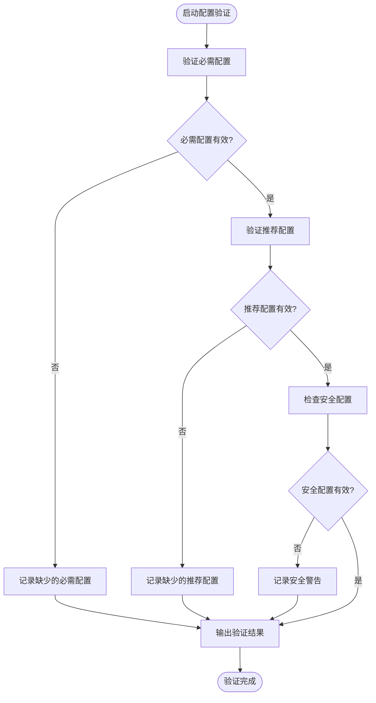
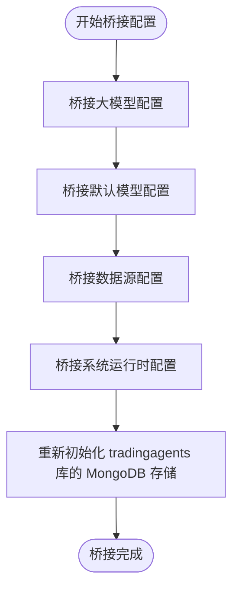
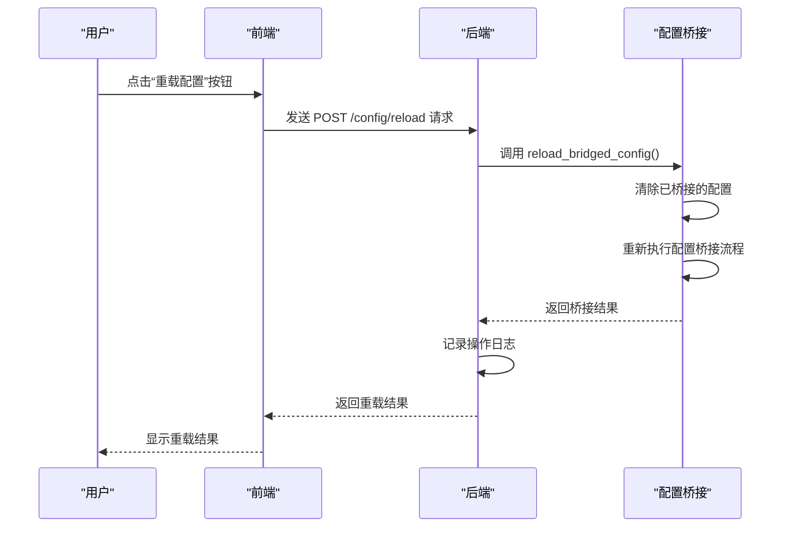

# 配置验证

<cite>
**本文档引用的文件**   
- [config.py](file://app/core/config.py)
- [config_bridge.py](file://app/core/config_bridge.py)
- [startup_validator.py](file://app/core/startup_validator.py)
- [unified_config.py](file://app/core/unified_config.py)
- [config.py](file://app/routers/config.py)
- [models.py](file://app/models/config.py)
</cite>

## 目录
1. [配置验证](#配置验证)
2. [启动时配置验证流程](#启动时配置验证流程)
3. [配置桥接系统](#配置桥接系统)
4. [配置变更的实时验证](#配置变更的实时验证)
5. [配置验证错误排查指南](#配置验证错误排查指南)

## 启动时配置验证流程

系统在启动时会自动执行配置验证流程，确保所有必需的配置项都已正确设置。该流程由 `app/core/startup_validator.py` 文件中的 `StartupValidator` 类实现，主要包含以下几个步骤：

1. **验证必需配置项**：检查 MongoDB 和 Redis 的主机地址、端口、数据库名称等必需配置项是否已设置。
2. **验证推荐配置项**：检查 DeepSeek、DashScope 和 Tushare 等推荐配置项是否已设置。
3. **检查安全配置**：检查 JWT_SECRET 和 CSRF_SECRET 是否使用默认值，以及是否在生产环境中使用 DEBUG 模式。
4. **输出验证结果**：根据验证结果输出相应的日志信息，包括缺少的必需配置、无效的配置、缺少的推荐配置和安全警告。

**图示来源**
- [startup_validator.py](file://app/core/startup_validator.py#L47-L88)
- [startup_validator.py](file://app/core/startup_validator.py#L91-L113)
- [startup_validator.py](file://app/core/startup_validator.py#L213-L228)

**本节来源**
- [startup_validator.py](file://app/core/startup_validator.py#L44-L287)

## 配置桥接系统

配置桥接系统负责将统一配置系统的配置桥接到环境变量，以便 TradingAgents 核心库能够使用这些配置。该系统由 `app/core/config_bridge.py` 文件中的 `bridge_config_to_env` 函数实现，主要包含以下几个步骤：

1. **桥接大模型配置**：从数据库读取大模型厂家配置，并将其写入环境变量。
2. **桥接默认模型配置**：将默认模型、快速分析模型和深度分析模型写入环境变量。
3. **桥接数据源配置**：从数据库读取数据源配置，并将其写入环境变量。
4. **桥接系统运行时配置**：将系统运行时配置（如港股请求间隔、超时时间等）写入环境变量。
5. **重新初始化 tradingagents 库的 MongoDB 存储**：确保 tradingagents 库使用最新的配置。

**图示来源**
- [config_bridge.py](file://app/core/config_bridge.py#L15-L287)

**本节来源**
- [config_bridge.py](file://app/core/config_bridge.py#L15-L287)

## 配置变更的实时验证

当用户通过 Web 界面修改配置后，可以通过调用 `/config/reload` API 端点来重新加载配置并桥接到环境变量。该功能由 `app/routers/config.py` 文件中的 `reload_config` 函数实现，主要包含以下几个步骤：

1. **调用 `reload_bridged_config` 函数**：该函数会清除已桥接的配置，并重新执行配置桥接流程。
2. **记录操作日志**：记录配置重载操作的详细信息，包括操作类型、操作内容和操作结果。

**图示来源**
- [config.py](file://app/routers/config.py#L37-L77)

**本节来源**
- [config.py](file://app/routers/config.py#L37-L77)

## 配置验证错误排查指南

当配置验证失败时，系统会输出详细的错误信息，帮助用户快速定位问题。以下是一些常见的配置验证错误及其解决方案：

### 常见错误代码和解决方案

| 错误代码 | 错误信息 | 解决方案 |
|--------|--------|--------|
| `MISSING_REQUIRED_CONFIG` | 缺少必需配置 | 检查 `.env` 文件，确保所有必需配置项都已设置 |
| `INVALID_CONFIG_FORMAT` | 配置格式错误 | 检查配置项的值是否符合要求，例如端口号是否在 1-65535 范围内 |
| `DEFAULT_JWT_SECRET` | JWT_SECRET 使用默认值 | 修改 `.env` 文件中的 `JWT_SECRET`，使用一个强密码 |
| `DEFAULT_CSRF_SECRET` | CSRF_SECRET 使用默认值 | 修改 `.env` 文件中的 `CSRF_SECRET`，使用一个强密码 |
| `DEBUG_IN_PRODUCTION` | 生产环境使用 DEBUG 模式 | 修改 `.env` 文件中的 `DEBUG`，设置为 `false` |

### 排查步骤

1. **检查 `.env` 文件**：确保所有必需配置项都已正确设置。
2. **检查配置项的值**：确保配置项的值符合要求，例如端口号是否在 1-65535 范围内。
3. **检查安全配置**：确保 `JWT_SECRET` 和 `CSRF_SECRET` 不使用默认值，且生产环境中 `DEBUG` 设置为 `false`。
4. **查看日志信息**：根据日志信息中的错误提示，逐步排查问题。

**本节来源**
- [startup_validator.py](file://app/core/startup_validator.py#L236-L287)